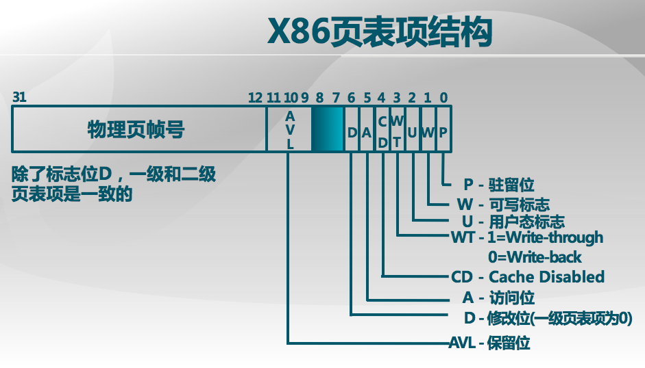

#lab1 report

##练习0：填写已有实验

使用`meld`将lab1中代码填入lab2中。
	
##练习1：实现 first-fit 连续物理内存分配算法（需要编程）

####数据结构
每个物理页用一个Page数据结构表示。Page的定义如下，包含了映射此物理页的虚拟页个数**ref**，描述物理页属性的**flags**，所属连续内存块的大小**property**和双向链接各个Page结构的**page\_link**双向链表。**flags**中包含是否被保留，是否空闲的标志。

```
struct Page {
    int ref;        // page frame's reference counter
    uint32_t flags; // array of flags that describe the status of the page frame
    unsigned int property;// the num of free block, used in first fit pm manager
    list_entry_t page_link;// free list link
};
```

本实验中，每个物理页对应一个Page，连续内存块的最小单位是一页，其中地址最小的一页（Head Page）的property是这个连续内存块的大小。用双向链表管理空闲块，链表节点是连续空闲块的Head Page的page\_link，按照地址大小排序。free\_area\_t定义如下，包含头结点和总空闲页数。

```
/* free_area_t - maintains a doubly linked list to record free (unused) pages */
typedef struct {
            list_entry_t free_list;    // the list header
            unsigned int nr_free;      // # of free pages i
n this free list
} free_area_t;
```

####实现思路
每个空闲连续内存块用它的Head Page管理起来，按地址大小放入双向链表中。分配时，从小到大，检查Head Page中的property属性，如果满足大小要求，就使用该内存块，如有必要将该内存块进行分割，从链表中删去原节点，加入分割后的空闲块的节点。释放时，加入链表，找到与其相邻的节点，如果能合并就合并，注意修改链表。

####初始化
除了Head Page，每一页的property，flags，ref置0，表示非保留页、非Head Page、没有引用。对Head Page，property设为块大小，flags中使能property属性。更新总空闲页数，将Head Page的page\_link加入链表尾部（按照地址从小到大初始化）。

```
static void
default_init_memmap(struct Page *base, size_t n) {
    assert(n > 0);
    struct Page *p = base;
    for (; p != base + n; p ++) {
        assert(PageReserved(p));
        p->flags = p->property = 0;
        set_page_ref(p, 0);
    }
    base->property = n;
    SetPageProperty(base);
    nr_free += n;
    list_add_before(&free_list, &(base->page_link));
}
```

####分配
分配时先检查是否小于等于总空闲空间。对链表从前往后遍历（地址从小到大），找到第一个块大小不小于需要的块，如大于所需，分割成两份，地址小的作为分配的页，地址大的作为空闲页，将空闲页插入链表，从链表删除分配的页。更新总空闲页数。

```
static struct Page *
default_alloc_pages(size_t n) {
    assert(n > 0);
    if (n > nr_free) {
        return NULL;
    }
    struct Page *page = NULL;
    list_entry_t *le = &free_list;
    while ((le = list_next(le)) != &free_list) {
        struct Page *p = le2page(le, page_link);
        if (p->property >= n) {
            page = p;
            break;
        }
    }
    if (page != NULL) {
        if (page->property > n) {
            struct Page *p = page + n;
            p->property = page->property - n;
            SetPageProperty(p);
            list_add(&(page->page_link), &(p->page_link));
        }
        list_del(&(page->page_link));
        nr_free -= n;
        ClearPageProperty(page);
    }
    return page;
}
```

####释放
将释放块中每一页的引用清零。设置Head Page，插入链表。如果前一项不是表头且与此块相邻，则向前合并，更新标记并删除此块的节点。如果后一项不是表头且与此块相邻，则向后合并，更新标记并删除后一项的节点。更新总空闲页数。

```
static void
default_free_pages(struct Page *base, size_t n) {
    assert(n > 0);
    struct Page *p = base;
    for (; p != base + n; p ++) {
        set_page_ref(p, 0);
    }
    
    base->property = n;
    SetPageProperty(base);
    
    list_entry_t *le = &free_list;
    while(1){
    	le = list_next(le);
    	p = le2page(le, page_link);
    	if(le==&free_list || base<p){
    		list_add_before(&(p->page_link), &(base->page_link));
    		break;
    	}
    }
    
    le = list_prev(&(base->page_link));
    if(le!=&free_list){
    	p = le2page(le, page_link);
    	if(p + p->property == base){
    		list_del(&(base->page_link));
    		p->property += base->property;
			base->property = 0;
			ClearPageProperty(base);
			base = p;
    	}
    }
    le = list_next(&(base->page_link));
    if(le!=&free_list){
		p = le2page(le, page_link);
		if(base + base->property == p){
			list_del(&(p->page_link));
			base->property += p->property;
			p->property = 0;
			ClearPageProperty(p);
		}
	}
    nr_free += n;
}
```

###进一步的改进空间

- 小的外碎片较多，会影响查找速度。可设定阈值h，使得分割的小碎片大小至少为h，小于h则不分割。
- 现在只用一个链表管理空闲块，查找慢。可分割成多个链表，查找链表时先判断此链表管理空闲块的总空间大小，一个链表找不到就移到下一个链表。减少了查找时间。

##练习2：实现寻找虚拟地址对应的页表项（需要编程）

####数据结构及宏定义
pde和pte的定义如下：

```
页目录项内容 = (页表起始物理地址 & ~0x0FFF) | PTE\_U | PTE\_W | PTE\_P
页表项内容 = (pa & ~0x0FFF) | PTE\_P | PTE\_W

PTE_U:位3，表示用户态的软件可以读取对应地址的物理内存页内容
PTE_W:位2，表示物理内存页内容可写
PTE_P:位1，表示物理内存页存在
```

相关宏定义：

```
PDX(la) = the index of page directory entry of VIRTUAL ADDRESS la.
KADDR(pa) : takes a physical address and returns the corresponding kernel virtual address.
set_page_ref(page,1) : means the page be referenced by one time
page2pa(page): get the physical address of memory which this (struct Page *) page  manages
PDE_ADDR(pde) : address in page table or page directory entry

PTE_P           0x001   // page table/directory entry flags bit : Present
PTE_W           0x002   // page table/directory entry flags bit : Writeable
PTE_U           0x004   // page table/directory entry flags bit : User can access
```

####实现思路
目标是找到一个虚地址对应的二级页表项的内核虚地址。如果该二级页表不存在，则根据create参数的值来处理是否创建新的二级页表。

1. 找到la对应的pde的虚拟地址
2. 如果pde中存在位为0
	1. create为0，不创建二级页表，返回NULL
	2. 创建二级页表失败，返回NULL
	3. 创建二级页表成功
		* 设置引用为1
		* 得到该页物理地址，进而转换为虚拟地址，并用此清空页
		* 将该页物理地址及标记填入pde
3. 找到la对应的pte的虚拟地址，返回

这里要注意的一点时我们只能使用虚拟地址进行访存。对虚拟地址va使用(\*va)便可得到对应内存的值，因此(\*pde\_vir)就是pde的值。另外可用pgdir[index]得到页目录表项的内容，加个取地址符`&`就变成了虚拟地址。

```
pte_t *
get_pte(pde_t *pgdir, uintptr_t la, bool create) {
    /* LAB2 EXERCISE 2: 2014011336
	pde_t *pde_vir = &pgdir[PDX(la)];				// virtual addr of la.pde
	if(!(*pde_vir&PTE_P)){							// pde not present
		struct Page* page;							
		if(!create||!(page = alloc_page())) return NULL;		// don't create
		set_page_ref(page, 1);
		uintptr_t page_pa = page2pa(page);			//page physical addr
		memset(KADDR(page_pa), 0, PGSIZE);			//clear page
		(*pde_vir) = page_pa | PTE_P | PTE_W | PTE_U;			//set pde 
	}
	pte_t *pt_vir = KADDR(PDE_ADDR(*pde_vir));		//Page Table virtual addr
	return &pt_vir[PTX(la)];						//pte virtual addr
}
```

###请描述页目录项（Pag Director Entry）和页表（Page Table Entry）中每个组成部分的含义和以及对ucore而言的潜在用处。

原理课的课件中：


`mmu.h`中有相关定义：

```
/* page table/directory entry flags */
#define PTE_P           0x001                   // Present
#define PTE_W           0x002                   // Writeable
#define PTE_U           0x004                   // User
#define PTE_PWT         0x008                   // Write-Through
#define PTE_PCD         0x010                   // Cache-Disable
#define PTE_A           0x020                   // Accessed
#define PTE_D           0x040                   // Dirty
#define PTE_PS          0x080                   // Page Size
#define PTE_MBZ         0x180                   // Bits must be zero
#define PTE_AVAIL       0xE00                   // Available for software use
```

发现二者几乎完全相同。

- P是存在位，如果P=1，表示页表地址指向的该页在内存中，如果P=0，表示不在内存中
- W是可写位，权限控制
- U，是否可在用户态访问，权限控制
- PWT，表示是否采用写透方式，写透方式就是既写内存（RAM）也写高速缓存,该位为1表示采用写透方式
- PCD，表示是否启用高速缓存,该位为1表示启用高速缓存
- A，访问位，当对页目录项进行访问时，A位=1
- D，对应页是否被修改过。若修改过，则在删除页表项时需要写回磁盘
- PS，Page Size标志，只适用于页目录项。如果置为1，页目录项指的是4MB的页面
- MBZ，0
- AVAIL，保留位

###如果ucore执行过程中访问内存，出现了页访问异常，请问硬件要做哪些事情？

1. 保存被打断的程序现场
2. 跳到中断服务例程
3. 把引起页访问异常的线性地址装到寄存器CR2中，并给出出错码errorCode


##练习3：释放某虚地址所在的页并取消对应二级页表项的映射（需要编程）

1. 检查pte对应的页是否存在
2. 将物理页对应的Page引用数减一
	- 如果此时引用数为0，则释放物理页
3. 清空pte
4. 刷新tlb

```
static inline void
page_remove_pte(pde_t *pgdir, uintptr_t la, pte_t *ptep) {
    /* LAB2 EXERCISE 3: 2014011336
	if(*ptep & PTE_P){								//valid
		struct Page *page = pte2page(*ptep);
		page_ref_dec(page);
		if(page->ref==0) free_page(page);
		*ptep = 0;
		tlb_invalidate(pgdir, la);
	}
}
```


#### 数据结构Page的全局变量（其实是一个数组）的每一项与页表中的页目录项和页表项有无对应关系？如果有，其对应关系是啥？

有关系。Page管理的是物理页，每一项对应一个物理页。每个页目录项和页表项可能对应0~1个物理页，但是每个物理页可能对应多个页目录项/页表项。


####如果希望虚拟地址与物理地址相等，则需要如何修改lab2，完成此事？ 鼓励通过编程来具体完成这个问题

更新段映射，使得

```
virt addr + 0xC0000000 = linear addr = phy addr + 0xC0000000
```

##与参考答案的区别
####练习一
参考答案将每一个空闲页都加入空闲块链表中，修改时多做了很多无用功，查找也慢。我是将每个空闲块的Head Page 加入空闲块链表，减少了修改的内容，加快了查找速度

####练习二
无

####练习三
无

##知识点
####列出你认为本实验中重要的知识点，以及与对应的OS原理中的知识点，并简要说明你对二者的含义，关系，差异等方面的理解（也可能出现实验中的知识点没有对应的原理知识点）
- 连续内存分配算法 First Fit 的分配和释放。实验中具体实现了分配和释放的步骤，对于空闲块的组织有了具体的了解。
- 页表的查找、修改、删除。实验让我加强了对虚拟地址和物理地址的分辨能力，修改页表项需要使用页表项的虚拟地址。

####列出你认为OS原理中很重要，但在实验中没有对应上的知识点
- 段机制
- 地址映射的转换
