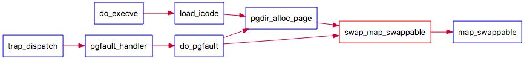

#lab3 report

[TOC]

##练习0：填写已有实验

使用`meld`将lab2中代码填入lab3中。

​	

## 练习1：给未被映射的地址映射上物理页(需要编程)

#### 数据结构

##### vma_struct

```c
struct vma_struct {
    // the set of vma using the same PDT
    struct mm_struct *vm_mm;
    uintptr_t vm_start; // start addr of vma
    uintptr_t vm_end; // end addr of vma
    uint32_t vm_flags; // flags of vma
    //linear list link which sorted by start addr of vma
    list_entry_t list_link;
};
```

##### mm_struct

```c
struct mm_struct {
    // linear list link which sorted by start addr of vma
    list_entry_t mmap_list;
    // current accessed vma, used for speed purpose
    struct vma_struct *mmap_cache;
    pde_t *pgdir; // the PDT of these vma
    int map_count; // the count of these vma
    void *sm_priv; // the private data for swap manager
};
```

对于每一个PDT，有一个mm，mm管理此PDT的vma，vma用地址范围描述，在PDT中连续占用表项，互不相交。


#### 实现思路

页访问异常的原因：

1. 虚拟页存在，物理页不存在，页表项为0
2. 物理页不在内存，页表项非空，Present=0
3. 不满足访问权限

其中练习一要解决的是第一个。给未被映射的地址映射上物理页，需要先分配一个物理页，设置访问权限，然后建立虚拟地址到物理地址的映射。具体步骤如下：

1. 参考页面所在 VMA 的权限，设置物理页的访问权限
2. 通过虚拟地址和PDT基址，得到PTE，确认表项为0。为此虚拟页分配一个物理页，设置访问权限，建立映射


#### 具体步骤

##### 设置访问权限

用户态，根据vma的权限设定是否可写：

```c
uint32_t perm = PTE_U;
if (vma->vm_flags & VM_WRITE) {
    perm |= PTE_W;
}
```


##### 分配一个物理页，建立映射

使用`get_pte()`得到表项，如果PT不存在，创建之。如果物理内存不够，报错。如果PTE=0，说明虚拟页存在，物理页不存在，则调用`pgdir_alloc_page`虚拟页分配一个物理页，设置访问权限，建立映射。

```c
ptep = get_pte(mm->pgdir, addr, 1);
if (ptep == NULL ) {
    cprintf("do_pgfault failed: get_pte return NULL\n");
    goto failed;
}
if (*ptep == 0){
    // allocate a page size memory & setup an addr map
    // pa<->la with linear address la and the PDT pgdir
    struct Page* p =  pgdir_alloc_page(mm->pgdir, addr, perm);
    if(p == NULL){
        cprintf("do_pgfault failed: pgdir_alloc_page return NULL\n");
        goto failed;
    }
} 
```


#### 问题

##### 请描述页目录项（Pag Director Entry）和页表（Page Table Entry）中组成部分对ucore实现页替换算法的潜在用处。

要实现页替换算法，需要区别在内存中的页，在外存中的页和不存在的页，以及知道在外存中的页所在扇区。这一点是通过 PTE做到的。如果一个页在内存中，PTE_P标记为1；不存在，则PTE全0；在外存中，则PTE_P为0，接下来的7位暂时保留，可以用作各种扩展，而原来用来表示页帧号的高24位地址，恰好可以用来表示此页在硬盘上的起始扇区的位置。

##### 如果ucore的缺页服务例程在执行过程中访问内存，出现了页访问异常，请问硬件要做哪些事情？

1. 保存被打断的程序现场，依次压入当前被打断程序使用的EFLAGS，CS，EIP，errorCode
2. 页访问异常的中断号是0xE，CPU把异常中断号0xE对应的中断服务例程的地址(vectors.S中的标号vector14处)加载到CS和EIP寄存器中，开始执行中断服务例程
3. 把引起页访问异常的线性地址装到寄存器CR2中，并给出出错码errorCode


##练习2：补充完成基于FIFO的页面替换算法(需要编程)

#### 数据结构

为了表示物理页可被换出或已被换出的情况，可对Page数据结构进行扩展:

```c
struct Page {
......
list\_entry\_t pra\_page\_link;
uintptr\_t pra\_vaddr;
};
```

**pra_page_link**可用来构造按页的第一次访问时间进行排序的一个链表，这个链表的开始表示第一次访问时间最近的页，链表结尾表示第一次访问时间最远的页。当然链表头可以就可设置为pra_list_head(定义在swap_fifo.c中)，构造的时机是在page fault发生后，进行 do_pgfault函数时。**pra_vaddr**可以用来记录此物理页对应的虚拟页起始地址。


####实现思路

在练习一中，页访问异常的第二个原因是：物理页不在内存，页表项非空，Present=0。此时需要使用页面替换算法将物理页换入内存。需要补完`do_pgfault`函数。页访问异常的第三个原因权限不够`do_pgfault`函数已经处理了。

在实现FIFO算法的swap_fifo.c中，需要完成**map_swappable**和**swap_out_vistim**函数。前一个函数用于记录页访问情况相关属性，后一个函数用于挑选需要换出的页。显然第二个函数依赖于第一个函数记录的页访问情况。**map_swappable**的函数调用图如下：



可以看到在分配页面和缺页异常时都会调用这个函数，用来记录物理页的访问情况。在FIFO中，可用链表维护Page结构，通过Page中的pra\_page\_link成员变量。按照访问顺序依次插入队首，置换时直接取队尾的页面置换。


#### 具体步骤

##### 补完do_pgfault

物理页不在内存，页表项非空，Present=0时，换入物理页面，建立映射关系，并在map_swappable中记录。还要维护`page->pra_vaddr`

```c
	/*LAB3 EXERCISE 1: 2014011336*/
    // get_pte of addr, if PT not exist, create it
    ptep = get_pte(mm->pgdir, addr, 1);
    if (ptep == NULL ) {
		cprintf("do_pgfault failed: get_pte return NULL\n");
		goto failed;
	}
    if (*ptep == 0){
    	// allocate a page size memory & setup an addr map
    	// pa<->la with linear address la and the PDT pgdir
    	struct Page* p =  pgdir_alloc_page(mm->pgdir, addr, perm);
    	if(p == NULL){
    		cprintf("do_pgfault failed: pgdir_alloc_page return NULL\n");
    		goto failed;
    	}
    } else {
    /*LAB3 EXERCISE 2: 2014011336*/
    	if(swap_init_ok) {
			struct Page *page=NULL;
			//(1）According to the mm AND addr, try to load the content of right disk page
			//    into the memory which page managed.
			int s = swap_in(mm, addr, &page);
			//(2) According to the mm, addr AND page, setup the map of phy addr <---> logical addr
			page_insert(mm->pgdir, page, addr, perm);
			page->pra_vaddr = addr;
			//(3) make the page swappable.
			swap_map_swappable(mm, addr, page, s);
		}
		else {
			cprintf("no swap_init_ok but ptep is %x, failed\n",*ptep);
			goto failed;
		}
    }
```


##### map_swappable

用链表维护Page结构，mm中有链表头。通过Page中的pra\_page\_link成员变量，按照访问顺序依次插入队首。

```c
static int
_fifo_map_swappable(struct mm_struct *mm, uintptr_t addr, struct Page *page, int swap_in)
{
    list_entry_t *head=(list_entry_t*) mm->sm_priv;
    list_entry_t *entry=&(page->pra_page_link);
 
    assert(entry != NULL && head != NULL);
    //record the page access situlation
    /*LAB3 EXERCISE 2: 2014011336*/
    //(1)link the most recent arrival page at the back of the pra_list_head qeueue.
    list_add_after(head, entry);
    return 0;
}
```


##### swap_out_vistim

置换时直接取队尾的页面置换。从链表中删除置换的页面。

```c
static int
_fifo_swap_out_victim(struct mm_struct *mm, struct Page ** ptr_page, int in_tick)
{
     list_entry_t *head=(list_entry_t*) mm->sm_priv;
         assert(head != NULL);
     assert(in_tick==0);
     /* Select the victim */
     /*LAB3 EXERCISE 2: 2014011336*/
     //(1)  unlink the  earliest arrival page in front of pra_list_head qeueue
     //(2)  set the addr of addr of this page to ptr_page
     list_entry_t *last = head->prev;
     *ptr_page = le2page(last, pra_page_link);
     list_del(last);
     return 0;
}
```


#### 问题

##### 如果要在ucore上实现"extended clock页替换算法"请给你的设计方案，现有的swap_manager框架是否足以支持在ucore中实现此算法？如果是，请给你的设计方案。如果不是，请给出你的新的扩展和基此扩展的设计方案。

足以支持在ucore中实现此算法，设计方案见challenge。


##### 需要被换出的页的特征是什么？

只有映射到用户空间且被用户程序直接访问的页面才能被交换，而被内核直接使用的内核空间的页面不能被换出。


##### 在ucore中如何判断具有这样特征的页？

`swap_map_swappable`函数记录物理页的访问情况。通过`do_pgfault`来调用`swap_map_swappable`函数来查询这些页的访问情况并间接调用相关函数，换出“不常用”的页到磁盘上。


##### 何时进行换入和换出操作？

换入时机：

当ucore或应用程序访问地址所在的页不在内存时，就会产生page fault异常，引起调用do_pgfault函数，此函数会判断产生访问异常的地址属于check_mm_struct某个vma表示的合法虚拟地址空间，且保存在硬盘swap文件中（即对应的PTE的高24位不为0，而最低位为0），则是执行页换入的时机，将调用swap_in函数完成页面换入。

换出时机：

ucore目前大致有两种策略，即积极换出策略和消极换出策略。积极换出策略是指操作系统周期性地（或在系统不忙的时候）主动把某些认为“不常用”的页换出到硬盘上，从而确保系统中总有一定数量的空闲页存在，这样当需要空闲页时，基本上能够及时满足需求；消极换出策略是指，只是当试图得到空闲页时，发现当前没有空闲的物理页可供分配，这时才开始查找“不常用”页面，并把一个或多个这样的页换出到硬盘上。


## 扩展练习 Challenge：实现识别dirty bit的 extended clock页替换算法（需要编程）

在现有的swap_manager框架中，替换`swap_out_victim`和`check_swap`

```c
struct swap_manager swap_manager_fifo =
{
     .name            = "fifo swap manager",
     .init            = &_fifo_init,
     .init_mm         = &_fifo_init_mm,
     .tick_event      = &_fifo_tick_event,
     .map_swappable   = &_fifo_map_swappable,
     .set_unswappable = &_fifo_set_unswappable,
     //.swap_out_victim = &_fifo_swap_out_victim,
	 .swap_out_victim = &_extended_clock_swap_out_victim,
     //.check_swap      = &_fifo_check_swap,
	 .check_swap      = &_extended_clock_check_swap,
};
```


`_extended_clock_swap_out_victim`如下。用head标识指针，循环时检查dirty bit并修改。如果一圈下来还没找到，就说明这一圈dirty bit都被修改为0，选择第一个置换。如果找到，从链表中删除，并移动head指针。

```c
static int
_extended_clock_swap_out_victim(struct mm_struct*mm, struct Page **ptr_page, int in_tick)
{
	list_entry_t *head=(list_entry_t*)mm->sm_priv;
	assert(head != NULL);
	assert(in_tick==0);

	list_entry_t *ptr = head->prev;
	while(ptr != head){
		struct Page *p = le2page(ptr, pra_page_link);
		//get pte
		pte_t *ptep = get_pte(mm->pgdir, p->pra_vaddr, 0);
		if((*ptep & PTE_D) == 0){
			//not dirty, swap out
			*ptr_page = p;
			list_del(head);
			list_add(ptr,head);
			list_del(ptr);
			return 0;
		}else{
			//dirty, change to not dirty
			*ptep&=(~PTE_D);
		}
		ptr = ptr->prev;
	}
	// a round after, select the first
	ptr = head->prev;
	struct Page *p = le2page(ptr, pra_page_link);
	*ptr_page = p;
	list_del(ptr);
	return 0;
}
```


测试函数`_extended_clock_check_swap`如下。然而，并没有达到想要的效果，检查原因后发现，**在写地址时没有对dirty bit进行修改，在替换页时才修改了dirty bit**。显然，处于这种情况下，无法实现 clock 算法，退化的clock算法和FIFO相同。

```c
static int
_extended_clock_check_swap(void) {
    cprintf("write Virt Page c in extended_clock_check_swap\n");
    *(unsigned char *)0x3000 = 0x0c;
    assert(pgfault_num==4);
    cprintf("write Virt Page a in extended_clock_check_swap\n");
    *(unsigned char *)0x1000 = 0x0a;
    assert(pgfault_num==4);
    cprintf("write Virt Page d in extended_clock_check_swap\n");
    *(unsigned char *)0x4000 = 0x0d;
    assert(pgfault_num==4);
    cprintf("write Virt Page b in extended_clock_check_swap\n");
    *(unsigned char *)0x2000 = 0x0b;
    assert(pgfault_num==4);
    cprintf("write Virt Page e in extended_clock_check_swap\n");
    *(unsigned char *)0x5000 = 0x0e;
    assert(pgfault_num==5);
    cprintf("write Virt Page b in extended_clock_check_swap\n");
    *(unsigned char *)0x2000 = 0x02;
    assert(pgfault_num==5);
    cprintf("write Virt Page c in extended_clock_check_swap\n");
	*(unsigned char *)0x3000 = 0x0c;
	cprintf("write Virt Page d in extended_clock_check_swap\n");
	*(unsigned char *)0x4000 = 0x0d;
    cprintf("write Virt Page a in extended_clock_check_swap\n");
    *(unsigned char *)0x1000 = 0x0a;
    assert(pgfault_num==6);
    cprintf("write Virt Page b in extended_clock_check_swap\n");
    *(unsigned char *)0x2000 = 0x0b;
    assert(pgfault_num==7);
    cprintf("write Virt Page c in extended_clock_check_swap\n");
    *(unsigned char *)0x3000 = 0x0c;
    assert(pgfault_num==8);
    cprintf("write Virt Page d in extended_clock_check_swap\n");
    *(unsigned char *)0x4000 = 0x0d;
    assert(pgfault_num==9);
    cprintf("write Virt Page e in extended_clock_check_swap\n");
    *(unsigned char *)0x5000 = 0x0e;
    assert(pgfault_num==10);
    cprintf("write Virt Page a in extended_clock_check_swap\n");
    assert(*(unsigned char *)0x1000 == 0x0a);
    *(unsigned char *)0x1000 = 0x0a;
    assert(pgfault_num==11);
    return 0;
}
```


##与参考答案的区别

####练习一
基本相同。参考答案还有对`swap_in`返回值的判断。然而`swap_in`若有返回值则必然是0，这条判断多余了。如果担心`swap_in`出错，则在`swap_in`中已经有assert 了。


####练习二
基本相同。参考答案在`_fifo_swap_out_victim`中还有队列不为0的假设，而我没考虑到这一点。


##知识点
####列出你认为本实验中重要的知识点，以及与对应的OS原理中的知识点，并简要说明你对二者的含义，关系，差异等方面的理解（也可能出现实验中的知识点没有对应的原理知识点）
- 页访问异常的三个原因及对应的处理方法。实验中具体介绍了如何区分三种原因，以及对每种原因的处理方案。
- 对FIFO算法，实验介绍了链表如何维护Page结构，如何记录物理页的访问情况。
- 实验设计了如何在磁盘上缓存内存页，从而能够支持虚存管理 。


####列出你认为OS原理中很重要，但在实验中没有对应上的知识点
- 对现场保存的寄存器的利用。实验中已经将保存的现场中有用的寄存器的值拿了出来。
