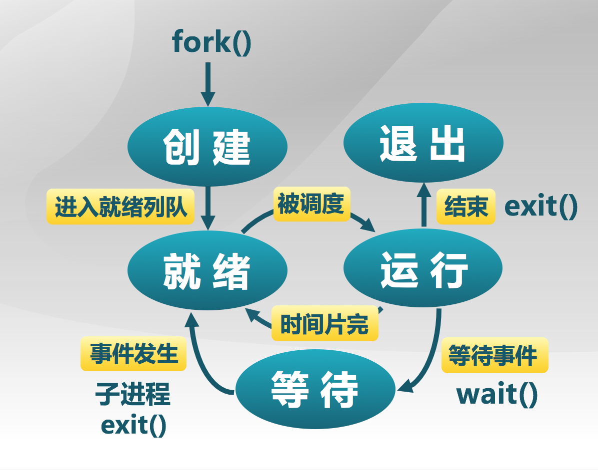

#lab5 report

[TOC]

##练习0：填写已有实验

使用`meld`填写已有实验。

#### 初始化系统调用对应的中断描述符

在`idt_init`中完成了中断描述符表的初始化。在本实验中，需要为系统调用设置一个特定中断号的中断门，修改`idt_init`代码如下：

```c
void
idt_init(void) {
     /* LAB1 2014011336 : STEP 2 */
    extern uintptr_t __vectors[];
    for (int i = 0; i < 256; ++i)
    {
        SETGATE(idt[i], 0, GD_KTEXT, __vectors[i], DPL_KERNEL);
    }
 	// set syscall
    SETGATE(idt[T_SYSCALL], 0, GD_KTEXT, __vectors[T_SYSCALL], DPL_USER);
    lidt(&idt_pd);
}
```

可以看到在执行加载中断描述符表**lidt**指令前，专门设置了一个特殊的中断描述符**idt[T_SYSCALL]**，第二个参数设0表示中断门（1为异常门）。它的特权级设置为**DPL_USER**，中断向量处理地址在 **\_\_vectors[T_SYSCALL]**处。这样建立好这个中断描述符后，一旦用户进程执行“INT T_SYSCALL”后，由于此中断允许用户态进程产生(注意它的特权级设置为DPL_USER)， 所以CPU就会从用户态切换到内核态，保存相关寄存器，并跳转到\__vectors[T_SYSCALL]处 开始执行，形成如下执行路径:

vector128(vectors.S)--\> \_\_alltraps(trapentry.S)--\>trap(trap.c)--\>trap\_dispatch(trap.c)----\>syscall(sysca ll.c)

在syscall中，根据系统调用号来完成不同的系统调用服务。

#### 修改alloc_proc函数

由于proc结构变化，需加入以下初始化语句

```c
proc->wait_state = 0;
proc->cptr = proc->optr = proc->yptr = NULL;
```

#### 修改do\_fork函数

修改lab4中第一步和第五步为：

```c
...
	//    1. call alloc_proc to allocate a proc_struct
    proc = alloc_proc();
    if(proc==NULL){
    	goto fork_out;
    }

    proc->parent = current;
    assert(current->wait_state == 0);

    //    5. insert proc_struct into hash_list && proc_list
    bool intr_flag;
	local_intr_save(intr_flag);
	{
		proc->pid = get_pid();
		hash_proc(proc);
		set_links(proc);
		//list_add(&proc_list, &(proc->list_link));
		//nr_process ++;
	}
...
```

#### 修改trap\_dispatch函数

时钟中断时加入当前进程可调度标志，实现时间片调度。

```c
...
	case IRQ_OFFSET + IRQ_TIMER:
        ticks ++;
        if (ticks % TICK_NUM == 0)
        {
            current->need_resched = 1;
            ticks = 0;
        }
        break;
...
```


## 练习1：加载应用程序并执行（需要编码）

#### 数据结构

**trapframe**

```c
struct trapframe {
    struct pushregs tf_regs;
    uint16_t tf_gs;
    uint16_t tf_padding0;
    uint16_t tf_fs;
    uint16_t tf_padding1;
    uint16_t tf_es;
    uint16_t tf_padding2;
    uint16_t tf_ds;
    uint16_t tf_padding3;
    uint32_t tf_trapno;
    /* below here defined by x86 hardware */
    uint32_t tf_err;
    uintptr_t tf_eip;
    uint16_t tf_cs;
    uint16_t tf_padding4;
    uint32_t tf_eflags;
    /* below here only when crossing rings, such as from user to kernel */
    uintptr_t tf_esp;
    uint16_t tf_ss;
    uint16_t tf_padding5;
} __attribute__((packed));
```


#### 实现思路

创建新进程时需重新设置中断帧trapframe，将用户态的代码段、数据段和堆栈在**tf**中设置好，指令指针指向进程第一条指令。这样中断**iret**返回时，能正确开始用户进程的执行，并确保在用户态能够响应中断。


#### 具体步骤

* tf_cs 设置为用户态代码段寄存器
* tf_ds=tf_es=tf_ss 设置为用户态数据段寄存器
* tf_esp 设置为用户态栈顶
* tf_eip 设置为进程入口
* tf_eflags 设置为允许中断

```c
static int
load_icode(unsigned char *binary, size_t size) {
	...
    
	//(6) setup trapframe for user environment
    struct trapframe *tf = current->tf;
    memset(tf, 0, sizeof(struct trapframe));
    tf->tf_cs = USER_CS;
    tf->tf_ds = tf->tf_es = tf->tf_ss = USER_DS;
    tf->tf_esp = USTACKTOP;
    tf->tf_eip = elf->e_entry;
    tf->tf_eflags = FL_IF;
  	
  	...     
}
```


#### 问题

##### 当创建一个用户态进程并加载了应用程序后，CPU是如何让这个应用程序最终在用户态执行起来的。即这个用户态进程被ucore选择占用CPU执行（RUNNING态）到具体执行应用程序第一条指令的整个经过。

应用程序加载完成后，此时中断帧中已经设置好用户态进程的运行环境了。当这个用户态进程被ucore选择占用CPU执行后，执行iret中断返回，将从tf中恢复运行环境，执行应用程序第一条指令。


##练习2：父进程复制自己的内存空间给子进程（需要编码）

#### 相关定义

```c
//page_insert - build the map of phy addr of an Page with the linear addr la
// paramemters:
//  pgdir: the kernel virtual base address of PDT
//  page:  the Page which need to map
//  la:    the linear address need to map
//  perm:  the permission of this Page which is setted in related pte
// return value: always 0
//note: PT is changed, so the TLB need to be invalidate 
int
page_insert(pde_t *pgdir, struct Page *page, uintptr_t la, uint32_t perm)
  
/* copy_range - copy content of memory (start, end) of one process A to another process B
 * @to:    the addr of process B's Page Directory
 * @from:  the addr of process A's Page Directory
 * @share: flags to indicate to dup OR share. We just use dup method, so it didn't be used.
 *
 * CALL GRAPH: copy_mm-->dup_mmap-->copy_range
 */
int
copy_range(pde_t *to, pde_t *from, uintptr_t start, uintptr_t end, bool share)
  
//page2kva(struct Page *page): return the kernel vritual addr of memory which page managed (SEE pmm.h)
```


####实现思路

copy_range 完成拷贝父进程内存中内容到子进程中的工作。分为拷贝和设置页表两部分。

#### 具体步骤

1. 得到页的内核虚拟地址后，使用`memcpy`函数完成拷贝。
2. 使用`page_insert`函数完成子进程页表的映射。

```c
int
copy_range(pde_t *to, pde_t *from, uintptr_t start, uintptr_t end, bool share){
  	...
      
		/* LAB5:EXERCISE2 2014011336
         * replicate content of page to npage, build the map of phy addr of nage with the linear addr start
         *
         * Some Useful MACROs and DEFINEs, you can use them in below implementation.
         * MACROs or Functions:
         *    page2kva(struct Page *page): return the kernel vritual addr of memory which page managed (SEE pmm.h)
         *    page_insert: build the map of phy addr of an Page with the linear addr la
         *    memcpy: typical memory copy function
         *
         * (1) find src_kvaddr: the kernel virtual address of page
         * (2) find dst_kvaddr: the kernel virtual address of npage
         * (3) memory copy from src_kvaddr to dst_kvaddr, size is PGSIZE
         * (4) build the map of phy addr of  nage with the linear addr start
         */
        void* src_kva = page2kva(page);
        void* dst_kva = page2kva(npage);
        memcpy(dst_kva, src_kva, PGSIZE);
        ret = page_insert(to, npage, start, perm);
  	
  	...
}
```


#### 问题

##### 请在实验报告中简要说明如何设计实现”Copy on Write 机制“，给出概要设计，鼓励给出详细设计。

在`copy_range`中，不进行内存复制，只是将页目录表的指针指向同一处，并将页设置只读，在某一进程需要写时会发生缺页异常，在异常处理时复制需要的内存，修改页的标志位。


## 练习3：阅读分析源代码，理解进程执行 fork/exec/wait/exit 的实现，以及系统调用的实现（不需要编码）

#### fork/exec/wait/exit函数的分析

根据实验指导书，应用程序调用的exit/fork/wait/getpid等库函数最终都会调用syscall函数，只是调用的参数不同而已。与进程相关的各个系统调用属性如下所示:

| 系统调用名    | 含义                                       | 具体完成服务的函数             |
| -------- | ---------------------------------------- | --------------------- |
| SYS_exit | process exit                             | do_exit               |
| SYS_fork | create child process,dup mm              | do_fork-->wakeup_proc |
| SYS_wait | wait child process                       | do_wait               |
| SYS_exec | after fork, processexecute a new program | do_execve             |

##### fork

调用`do_fork`函数完成子进程的创建和资源的分配。并通过`wakeup_proc(proc);`语句将新建的子进程放入就绪队列。

##### exec

调⽤`do_execve`函数，做以下工作：

1. 回收原内存空间

2. 1. lcr3(boot_cr3)
   2. exit_mmap\put_pgdir\mm_destory

3. load_icode

4. 1. 创建新空间

   2. 1. mm_create\setup_pgdir

   3. 填上代码内容，解析ELF

   4. 1. mm_map建立合法空间vma（此时未建立页表）
      2. 拷贝section from ELF
      3. 建立虚地址物理地址映射关系
      4. mm_map, user stack建立

   5. load new page table

   6. setup trapframe：特权级转换到用户空间执行

   7. 模拟ring3产生中断到ring0，iret回到ring3。内核栈与用户栈的切换

##### wait

调用`do_wait`函数，通过循环不断查找子进程。如果参数pid不为0，查找pid且状态为PROC_ZOMBIE的子进程，否则查找任意一个状态为PROC_ZOMBIE的子进程。如果没找到进入PROC_SLEEPING，睡眠原因为WT_CHILD，并调用schedule。如果找到了，释放该子进程的资源并返回，即把子进程控制块从两个进程队列proc_list和hash_list中删除，并释放子进程的内核堆栈和进程控制块。自此，子进程才彻底地结束了它的执行过程，消除了它所占用的所有资源。

##### exit

调用`do_exit`函数，

1. 如果是**用户进程**，回收此用户进程所占用的用户态虚拟内存空间：
   1. **lcr3**(boot_cr3)，切换到内核态的页表上
   2. 如果当前进程控制块的成员变量mm的成员变量**mm_count**减1后为0(表明这个mm没有再 被其他进程共享，可以彻底释放进程所占的用户虚拟空间了。)，则开始回收用户进程所占 的内存资源
      1. **exit_mmap**函数释放current->mm->vma链表中每个vma描述的进程合法空间中实际分配的内存，然后把对应的页表项内容清空，最后还把页表所占用的空间释放并把对应的页目录表项清空;
      2. **put_pgdir**函数释放当前进程的页目录所占的内存;
      3. **mm_destroy**函数释放mm中的vma所占内存，最后释放mm所占内存;
   3. 设置current->mm为NULL，表示与当前进程相关的用户虚拟内存空间和对应的内存管 理成员变量所占的内核虚拟内存空间已经回收完毕;
2. 设置当前进程的执行状态current->state=**PROC_ZOMBIE**，当前进程的退出码 current->exit_code=error_code。此时当前进程已经不能被调度了，需要此进程的父进程来做 最后的回收工作
3. 如果当前进程的父进程current->parent处于**等待子进程状态**，则唤醒父进程(即执行“wakup_proc(current->parent)”)，让父进程帮助自己完成最后的资源 回收;
4. 如果当前进程还有子进程，则需要把这些**子进程过继**给内核线程initproc。如果某个子进程的执行状态是 PROC_ZOMBIE，则需要唤醒initproc来完成对此子进程的最后回收工作。
5. 执行**schedule()**函数，选择新的进程执行。

#### 系统调用的实现

使用统一的中断描述符`T_SYSCALL`，不同系统调用根据参数不同加以区分。在中断处理例程`syscall`中实现不同系统调用。

#### 问题

##### 请分析fork/exec/wait/exit在实现中是如何影响进程的执行状态的？

* fork：复制父进程到子进程，并把子进程设置为就绪状态
* exec：将一个进程改造为另一个进程
* wait：循环睡眠等待子进程，若找到合适的僵尸子进程，则回收资源返回
* exit：自己设为僵尸状态，唤醒父进程。将子进程过继给initproc，如有僵尸子进程，令initproc回收该子进程资源。


##### 请给出ucore中一个用户态进程的执行状态生命周期图（包执行状态，执行状态之间的变换关系，以及产生变换的事件或函数调用）。（字符方式画即可）



##与参考答案的区别

#### 练习0

初始化系统调用对应的中断描述符中，`SETGATE(idt[T_SYSCALL], 0, GD_KTEXT, __vectors[T_SYSCALL], DPL_USER);`第二个参数设0表示中断门（1为异常门），而参考答案设的是1，与语义不符，建议更正。

trap\_dispatch中时钟中断处理时，我将tick归零，而答案没有，可能会在溢出后的一个时间片出问题。


####练习1

基本相同。


####练习2
基本相同


#### 练习3

无参考答案


##知识点
####列出你认为本实验中重要的知识点，以及与对应的OS原理中的知识点，并简要说明你对二者的含义，关系，差异等方面的理解（也可能出现实验中的知识点没有对应的原理知识点）
- 创建第一个用户进程，实验中有关于tf如何设置的具体说明，原理中每一个步骤都可以找得到对应的代码，很清晰。
- 父进程创建子进程。实验中只要求填写局部复制的代码，缺少对do_fork()整体的了解，而原理中讲的比较详细。
- 系统调用对进程状态的影响，练习3中有对此的要求，原理上只是泛泛而谈，实验中结合代码来更踏实。


####列出你认为OS原理中很重要，但在实验中没有对应上的知识点
- 因为函数调用比较多，最好能讲一下cpu当前指令的转换，如fork/exit/exec之后跳到哪里执行了。
- 创建第一个用户进程时是如何将initproc替换为hello的，实验中只有局部代码没有整体把握。
- 进程切换的时机，是每一个中断后还是只有时钟中断后？
