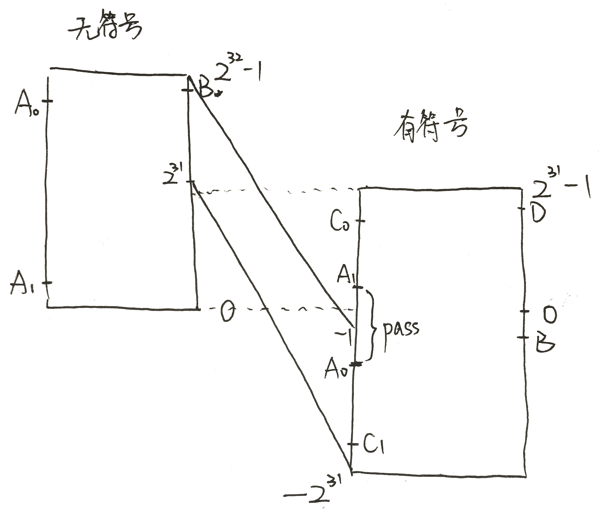

#lab6 report

[TOC]

##练习0：填写已有实验

使用`meld`填写已有实验。

对之前实验代码的修改：

#### `trap.c:trap_dispatch`

修改时钟中断的处理：调用`sched_class_proc_tick`

```c
case IRQ_OFFSET + IRQ_TIMER:
	ticks ++;
	sched_class_proc_tick(current);
	break;
```

#### `proc.h:proc_struct`

加入lab6需要的成员变量：

```c
    struct run_queue *rq;                       // running queue contains Process
    list_entry_t run_link;                      // the entry linked in run queue
    int time_slice;                             // time slice for occupying the CPU
    skew_heap_entry_t lab6_run_pool;            // FOR LAB6 ONLY: the entry in the run pool
    uint32_t lab6_stride;                       // FOR LAB6 ONLY: the current stride of the process 
    uint32_t lab6_priority;                     // FOR LAB6 ONLY: the priority of process, set by lab6_set_priority(uint32_t)
```

#### `proc.c:alloc_proc`

加入对 proc 结构中新增变量的初始化：

```c
	    proc->rq = NULL;
        list_init(&(proc->run_link));
        proc->time_slice = 0;
        proc->lab6_run_pool.left = proc->lab6_run_pool.right = proc->lab6_run_pool.parent = NULL;
        proc->lab6_stride = 0;
        proc->lab6_priority = 0;
```

#### `sched.c:sched_class_proc_tick`

将 `sched_class_proc_tick` 此static函数改为非static

```c
void sched_class_proc_tick(struct proc_struct *proc) {
	...
}
```


## 练习1: 使用 Round Robin 调度算法(不需要编码)

#### lab5, lab6的区别

1. 在 `init.c` 中，lab6加入了对调度器的初始化 `sched_init();`
2. 在 `trap.c` 中，lab6 将原来时钟中断时设置需要调度标准修改为调用 `sched_class_proc_tick` 函数。便于支持自己定制的调度算法。
3. proc_struct 加入了新的成员变量以满足 lab6 需求
4. alloc_proc 中对proc_struct新加入的变量增加初始化
5. lab6 定义了 `sched_class` 和 `run_queue` 数据结构，便于支持自己定制的调度算法。

#### 数据结构

**proc_struct**

```c
struct proc_struct {
    enum proc_state state;                      // Process state
    int pid;                                    // Process ID
    int runs;                                   // the running times of Proces
    uintptr_t kstack;                           // Process kernel stack
    volatile bool need_resched;                 // bool value: need to be rescheduled to release CPU?
    struct proc_struct *parent;                 // the parent process
    struct mm_struct *mm;                       // Process's memory management field
    struct context context;                     // Switch here to run process
    struct trapframe *tf;                       // Trap frame for current interrupt
    uintptr_t cr3;                              // CR3 register: the base addr of Page Directroy Table(PDT)
    uint32_t flags;                             // Process flag
    char name[PROC_NAME_LEN + 1];               // Process name
    list_entry_t list_link;                     // Process link list 
    list_entry_t hash_link;                     // Process hash list
    int exit_code;                              // exit code (be sent to parent proc)
    uint32_t wait_state;                        // waiting state
    struct proc_struct *cptr, *yptr, *optr;     // relations between processes
    struct run_queue *rq;                       // running queue contains Process
    list_entry_t run_link;                      // the entry linked in run queue
    int time_slice;                             // time slice for occupying the CPU
    skew_heap_entry_t lab6_run_pool;            // FOR LAB6 ONLY: the entry in the run pool
    uint32_t lab6_stride;                       // FOR LAB6 ONLY: the current stride of the process 
    uint32_t lab6_priority;                     // FOR LAB6 ONLY: the priority of process, set by lab6_set_priority(uint32_t)
};
```

**sched_class**

```c
struct sched_class {
    // the name of sched_class
    const char *name;
    // Init the run queue
    void (*init)(struct run_queue *rq);
    // put the proc into runqueue, and this function must be called with rq_lock
    void (*enqueue)(struct run_queue *rq, struct proc_struct *proc);
    // get the proc out runqueue, and this function must be called with rq_lock
    void (*dequeue)(struct run_queue *rq, struct proc_struct *proc);
    // choose the next runnable task
    struct proc_struct *(*pick_next)(struct run_queue *rq);
    // dealer of the time-tick
    void (*proc_tick)(struct run_queue *rq, struct proc_struct *proc);
    /* for SMP support in the future
     *  load_balance
     *     void (*load_balance)(struct rq* rq);
     *  get some proc from this rq, used in load_balance,
     *  return value is the num of gotten proc
     *  int (*get_proc)(struct rq* rq, struct proc* procs_moved[]);
     */
};
```

**run_queue**

```c
struct run_queue {
    list_entry_t run_list;
    unsigned int proc_num;
    int max_time_slice;
    // For LAB6 ONLY
    skew_heap_entry_t *lab6_run_pool;
};
```


#### 问题

##### 请理解并分析sched_calss中各个函数指针的用法，并接合Round Robin 调度算法描述 ucore的调度执行过程 

`sched_class` 和 `run_queue` 定义和用法如上，RR 调度算法实现了 `sched_class` 中的函数。

RR调度算法的调度思想 是让所有runnable态的进程分时轮流使用CPU时间。RR调度器维护当前runnable进程的有序运行队列。**当前进程的时间片用完之后，调度器将当前进程放置到运行队列的尾部，再从其头部取出进程进行调度。**

RR调度算法的就绪队列在组织结构上也是一个双向链表，只是增加了一个成员变量，表明在此就绪进程队列中的最大执行时间片。而且在进程控制块proc_struct中增加了一个成员变量**time_slice**，用来记录进程当前的可运行时间片段。在每个timer到时的时候，操作系统会递减当前执行进程的time_slice，当time_slice为0时，就意味着这个进程运行了一段时间（这个时间片段称为进程的时间片），需要把CPU让给其他进程执行，于是操作系统就需要让此进程重新回到rq的队列尾，且重置此进程的时间片为就绪队列的成员变量最大时间片max_time_slice值，然后再从rq的队列头取出一个新的进程执行。

0. 初始化

      1. 在kern_init中，调用了sched_init对调度框架采用默认的RR算法进行了初始化。

1. 进入就绪队列

   RR_enqueue。把某进程的进程控制块指针放入到rq队列末尾，且如果进程控制块的时间片为0，则需要把它重置为rq成员变量max_time_slice。这表示如果进程 在当前的执行时间片已经用完，需要等到下一次有机会运行时，才能再执行一段时间。

2. 选择下一个就绪进程

   RR_pick_next。选取就绪进程队列rq中的队头队列元素，并把队列 元素转换成进程控制块指针。

3. 移出就绪队列

   RR_dequeue。把就绪进程队列rq的进程控制块指针的队列元素删 除，并把表示就绪进程个数的proc_num减一。

4. 时钟中断

 RR_proc_tick。即每次timer到时后，trap函数将会间接调用此函数来 把当前执行进程的时间片time_slice减一。如果time_slice降到零，则设置此进程成员变量 need_resched标识为1，这样在下一次中断来后执行trap函数时，会由于当前进程程成员变量 need_resched标识为1而执行schedule函数，从而把当前执行进程放回就绪队列末尾，而从就 绪队列头取出在就绪队列上等待时间最久的那个就绪进程执行。


##### 请在实验报告中简要说明如何设计实现”多级反馈队列调度算法“，给出概要设计，鼓励给出详细设计

* 有多个就绪队列q1,q2,…,qn, 每个队列对应的时间片是 $t_0, 2t_0,…2^{n-1}t_0$。
* 一个进程第一次进入就绪状态，先进入q1等待。
* 首先调度q1中进程，采用时间片轮转，运行时间为q1对应的时间片。如果没有则调度q2中进程，以此类推。
* 当前进程的时间片用完时进程还没有完成，则需要降级进入下一级队列等待。直到进程完成或到最后一级qn。

特点：

- 多级就绪队列时间片长则优先级低
- CPU密集型程序下降很快切换开销变小
- IO密集型停在高优先级

##练习2: 实现 Stride Scheduling 调度算法（需要编码）

#### 基本思想

1. 为每个runnable的进程设置一个当前状态stride，表示该进程当前的调度权。另外定义其对应的pass值，表示对应进程在调度后，stride 需要进行的累加值。

2. 每次需要调度时，从当前runnable态的进程中选择stride最小的进程调度。

3. 对于获得调度的进程P，将对应的stride加上其对应的步长pass(只与进程的优先权有关系)。

4. 在一段固定的时间之后，回到2.步骤，重新调度当前stride最小的进程。

可以证明，如果令 P.pass =BigStride / P.priority 其中 P.priority 表示进程的优先权(大于 1)，而 BigStride 表示一个预先定义的大常数，则该调度方案为每个进程分配的时间将与其优先级成正比。

#### stride属性的溢出问题

在 stride溢出以后，基于stride 的比较可能会出现错误。对此的一个巧妙的解决方案是将原来的无符号比较变成有符号比较。可证明 STRIDE_MAX – STRIDE_MIN <= PASS_MAX，在加上之前对优先级有Priority > 1限制，我们有STRIDE_MAX – STRIDE_MIN <= BIG_STRIDE,于是我们只要将BigStride取在某个范围之内，即可保证对于任意两个 Stride 之差都会在机器整数表示的范围之内。而我们可以通过其与0的比较结构，来得到两个Stride 的大小关系。

下面以32位表示的stride为例，说明如何设置 BIG_STRIDE=0x7FFFFFFF=2^31-1 解决这个问题。



问题的根源在于用无符号比较的话，溢出后会产生错误。如图，A0,B 为步进之前的值，A1为A0步进之后的值，发生了溢出，无符号比较 A1\<B。因为 PASS <= BIG_STRIDE = 2^31-1，在有符号的表示中，A1 会落在 [0, 2^31-1) 之间，而 A1-B <= BIG_STRIDE = 2^31-1，因此 B 落在 [-2^31-1, 0)， A1-B\>0, 比较正确。

对于有符号中的溢出情况，如图中 C0, C1 所示，此时 $C1-D= -(D-C1) \le -(2^{32}-BIG\_STRIDE) =2^{31}-1$，因此得到的MSB为0，即 C1-D>0, 比较正确。

BIG_STRIDE 的设置的关键是要让步进之差的最大值在有符号正数的表示范围内。

#### 实现

##### 设置BIG_STRIDE

```c
define BIG_STRIDE  0x7FFFFFFF
```

##### STRIDE 初始化

```c
static void
stride_init(struct run_queue *rq) {
    list_init(&(rq->run_list));
    rq->lab6_run_pool = NULL;
    rq->proc_num  0;
}
```

##### 入队

```c
static void
stride_enqueue(struct run_queue *rq, struct proc_struct *proc) {
  	// 放入斜堆
    rq->lab6_run_pool = skew_heap_insert(rq->lab6_run_pool, &(proc->lab6_run_pool), proc_stride_comp_f);
    // 入队时如果时间片为0或大于最大值，归零
    if (proc->time_slice==0 || proc->time_slice>rq->max_time_slice) {
          proc->time_slice = rq->max_time_slice;
    }
    // 设置指针
    proc->rq = rq;
    // 计数
    rq->proc_num ++;
}
```

##### 出队

```c
static void
stride_dequeue(struct run_queue *rq, struct proc_struct *proc) {
    // 出队
    rq->lab6_run_pool = skew_heap_remove(rq->lab6_run_pool, &(proc->lab6_run_pool), proc_stride_comp_f);
    // 计数
    rq->proc_num --;
}
```

##### 选择调度的进程

```c
static struct proc_struct *
stride_pick_next(struct run_queue *rq) {
    // 得到 stride 最小的
    struct proc_struct * p = le2proc(rq->lab6_run_pool, lab6_run_pool);
    // 步进
    if (p->lab6_priority == 0){
        p->lab6_stride += BIG_STRIDE;
    } else { 
        p->lab6_stride += BIG_STRIDE / p->lab6_priority;
    }
    return p;
}
```

##### 时钟中断更新time_slice

```c
static void
stride_proc_tick(struct run_queue *rq, struct proc_struct *proc) {
     /* LAB6: 2014011336 */
    // 时间片减一
    if (proc->time_slice > 0){
        proc->time_slice --;
    }
    // 如果当前时间片用完，设置为可调度
    if (proc->time_slice == 0){
        proc->need_resched = 1;
    }
}
```


##与参考答案的区别

#### 练习0

我在 `trap.c` 中时钟中断时调用的是 `sched_class_proc_tick` 。为了解决可见性问题，我将此函数改为了非静态（参考piazza上的讨论）。而参考答案并没有用这个函数而是用了 `run_timer_list` 。这与提示不符，但是 `run_timer_list` 中也会调用 `sched_class_proc_tick` 。此处的不统一希望能改正，以节省不必要的的时间。


####练习2

刚开始我没有考虑 priority 为0的情况(我以为对优先级有Priority > 1限制)，结果出了问题。与参考答案对比才发现。

##知识点
####列出你认为本实验中重要的知识点，以及与对应的OS原理中的知识点，并简要说明你对二者的含义，关系，差异等方面的理解（也可能出现实验中的知识点没有对应的原理知识点）
- RR 算法是如何接管ucore的调度工作的。通过修改 trap.c 中的时钟中断处理函数，为时间片轮转提供支持，与原理中相对应。
- stride 是如何工作的。加pass，改time_slice，这些都和原理中一一对应。
- stride 如何解决溢出问题。虽然实验中只有 BIG_STRIDE 的设置，然而这个设置必须要在完全掌握解决溢出问题的技巧的基础上才能完成。这一点结合的很好。如果直接给出设置，恐怕很多人不会去弄明白其中原理。


####列出你认为OS原理中很重要，但在实验中没有对应上的知识点
- 调度点在哪。实验中缺少对调度点设置的练习。
